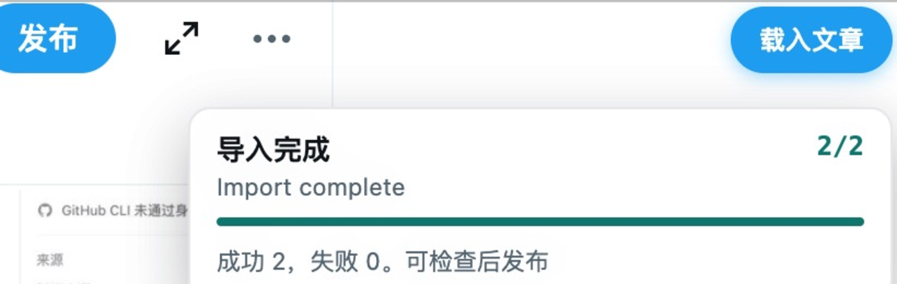
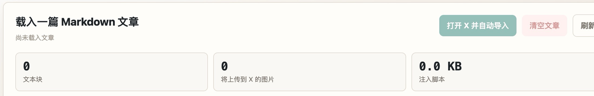
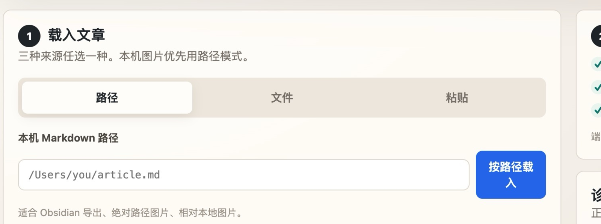
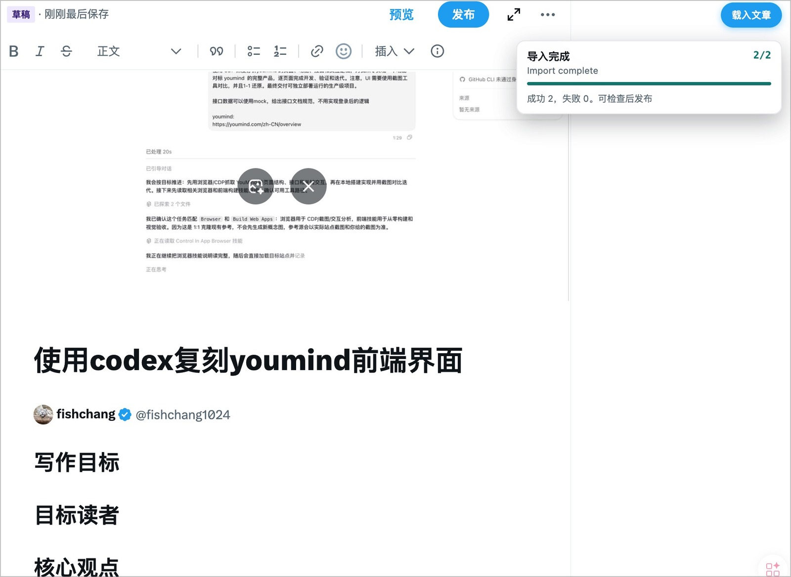
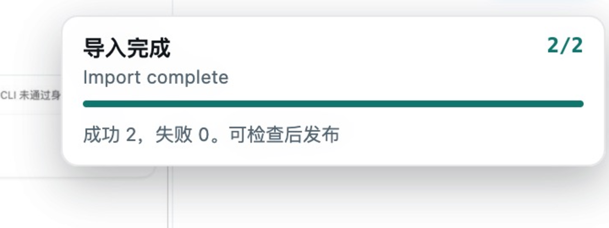

# X Article Markdown Publisher

[中文](README.md) | English

A Markdown-to-X-Articles importer using a local Node.js dashboard and a Chrome extension.

It is designed for long-form Markdown articles with local images, remote image URLs, cover images, code blocks, tweets, and tables. The tool imports content into an X Articles draft and never clicks the X Publish button for you.

This project is independent and is not affiliated with, endorsed by, or sponsored by X Corp., Twitter, or xAI.

Author on X: [@fishchang1024](https://x.com/fishchang1024)

## Project Name

Recommended public repository name:

```text
x-article-md-publisher
```

For GitHub release, `X Article Markdown Publisher` is the intended product name. It describes the actual product surface, avoids implying an official platform integration, and leaves room for CLI, dashboard, or automation workflows.

## Credits

Core ideas and implementation techniques are derived from or inspired by [xPoster](https://github.com/nevertoday/xposter), which is MIT licensed.

Keep `NOTICE` and `LICENSE` when redistributing this project. If you publish a fork or derivative project, mention xPoster in the README and avoid presenting this tool as an official X, Twitter, or xAI product.

## Requirements

- Node.js 18+
- Google Chrome or Chromium
- X account with X Articles access
- Chrome extension developer mode

Optional:

- macOS uses the built-in `sips` command for large PNG/JPEG compression.
- Windows/Linux currently upload original images unless you add your own image compressor.

## Install

```bash
git clone https://github.com/throughs/x-article-md-publisher.git
cd x-article-md-publisher
```

Load the Chrome extension:

1. Open `chrome://extensions`.
2. Enable Developer mode.
3. Click "Load unpacked".
4. Select the `extension/` directory.

The server code uses Node.js built-ins. `npm install` is only needed if you use the optional Playwright automation script.

## Start The Server

The Markdown file argument is optional. You can start the dashboard first, then load an article by local path, dropped file, or pasted text in the browser.

macOS / Linux:

```bash
./scripts/xarticle-server.sh start
./scripts/xarticle-server.sh start "/path/to/article.md"
./scripts/xarticle-server.sh status
./scripts/xarticle-server.sh stop
```

Windows PowerShell:

```powershell
.\scripts\xarticle-server.ps1 start
.\scripts\xarticle-server.ps1 start "C:\Users\you\article.md"
.\scripts\xarticle-server.ps1 status
.\scripts\xarticle-server.ps1 stop
```

Direct Node fallback on any platform:

```bash
node xarticle-server.js 8765
node xarticle-server.js "/path/to/article.md" 8765
```

Then open:

```text
http://localhost:8765
```

## Quick Start Workflow

### 1. Load The Chrome Extension

Open `chrome://extensions`, enable Developer mode, click "Load unpacked", and select the `extension/` directory.



### 2. Start The Local Server

You can start without a Markdown argument, then load the article in the dashboard.

macOS / Linux:

```bash
./scripts/xarticle-server.sh start
./scripts/xarticle-server.sh start "/path/to/article.md"
```

Windows PowerShell:

```powershell
.\scripts\xarticle-server.ps1 start
.\scripts\xarticle-server.ps1 start "C:\Users\you\article.md"
```

Then open `http://localhost:8765`.



### 3. Load Markdown In The Dashboard

Use one of the three input modes:

- Local path: best for Markdown files that reference local relative images. Browsers cannot reveal the full local path of a dragged file, so relative local images need this mode.
- Drop file: best for dropping or selecting a `.md` file with remote image URLs or data images; the file is read and loaded automatically.
- Paste text: best for copying Markdown text directly into the dashboard.

Optional cover upload is available in the dashboard. You can set a cover by manual upload or Markdown frontmatter `cover`. Without an explicit cover, the first body image stays in the body and is not promoted to cover.



### 4. Open X Articles

Click "Open X and import" in the dashboard, or open an X Articles editor manually:

```text
https://x.com/compose/articles/new
```

The local server arms one import trigger, and the Chrome extension reads the article payload from `http://localhost:8765`.



### 5. Import Into X

In the X editor, click the floating "载入文章" button. Keep the tab open while text, cover, and images are written into the editor. The progress panel shows the current image count, successful uploads, failed uploads, and retry status.



### 6. Review And Publish Manually

After import completes, review title, code blocks, tables, images, and cover in the X editor. This tool stops at draft import and never clicks the X Publish button for you.

## Dashboard Workflow

Typical flow:

1. Start the local server.
2. Load Markdown in the dashboard.
3. Optionally upload or clear a manual cover.
4. Open the X Articles editor.
5. Click the floating "载入文章" button from the extension.
6. Wait for image upload progress to finish.
7. Review the draft and publish manually.

Article sources:

- Local path: best for relative local images from Obsidian, Typora, or local notes.
- Dropped file: best for remote image URLs, data images, or Markdown that does not rely on relative local paths.
- Pasted text: best for Markdown copied directly from another editor.

## Markdown Metadata

YAML frontmatter is supported:

```md
---
title: Article title
cover: ./assets/cover.jpg
---
```

Title priority:

```text
frontmatter title > first H1 > file name
```

Cover priority:

```text
dashboard manual cover > frontmatter cover > no cover
```

If the cover points to an image already in the body, it is uploaded as the article cover and removed from the body image list. If the cover points to a separate image, it is uploaded only as the cover. Without `cover`, body images remain body images.

## Images And Paths

Supported image inputs:

- local absolute paths;
- relative paths from the Markdown file directory;
- `file://` URLs;
- `http://` and `https://` image URLs;
- `data:image/...;base64,...`.

macOS examples:

```md


```

Windows examples:

```md


```

Prefer forward slashes or `file:///C:/...` on Windows. Raw backslash paths can work in some cases, but Markdown escaping makes them easier to break.

## Platform Notes

| Platform | Notes |
| --- | --- |
| macOS | Use `scripts/xarticle-server.sh`; opening X prefers Google Chrome; large PNG/JPEG files are compressed with `sips`. |
| Windows | Use `scripts/xarticle-server.ps1`; drive-letter paths and `file:///C:/...` are supported; image compression is skipped by default. |
| Linux | Use `scripts/xarticle-server.sh`; opening X uses `xdg-open`; image compression is skipped by default. |

## API Endpoints

| Endpoint | Purpose |
| --- | --- |
| `GET /` | Dashboard |
| `GET /status` | Article status, image count, current progress |
| `GET /payload` | Full article payload |
| `GET /engine` | Injected page engine |
| `GET /inject-script` | Engine + current payload |
| `POST /progress` | Progress updates from the X page |
| `POST /cover` | Set manual cover image |
| `POST /cover/clear` | Clear manual cover image |

## Repository Publishing Checklist

- If you publish under another account or organization, replace the GitHub repository URL in the install command.
- Keep `LICENSE` and `NOTICE`.
- Keep xPoster attribution in this README.
- Do not use X, Twitter, or xAI branding in a way that implies official endorsement.
- Verify the full import flow with your current Chrome profile and X account.

## Troubleshooting

| Symptom | Fix |
| --- | --- |
| Floating import button does not appear | Refresh the X editor tab and reload the Chrome extension. |
| Button says the local service cannot be reached | Make sure `http://localhost:8765` is running. |
| Dashboard says no article is loaded | Load Markdown by local path, dropped file, or pasted text first. |
| Local images are missing | Use local path mode; browser drag/drop or file selection cannot provide the full local path; absolute paths / `file:///` also work. |
| Windows path with spaces fails | Prefer `C:/.../a%20b.jpg` or `file:///C:/.../a%20b.jpg`. |
| Many images make import look slow | Keep the X page open and watch the progress panel; image upload is the slowest step. |
| Upload progress is missing | Refresh the X editor tab and try again; the injected script also reports directly to `/progress`. |
| Port is occupied | Use the matching platform script with `status` and `stop` to inspect and stop the old service. |

## License

MIT. See `LICENSE` and `NOTICE`.
